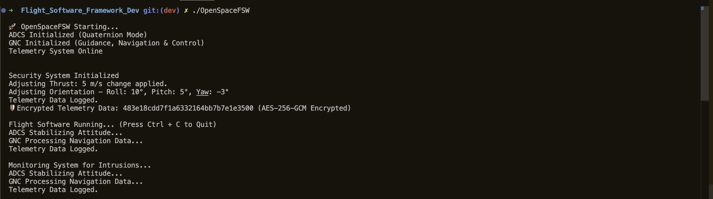

# Flight_Software_Framework (OpenSpaceFSW)

OpenSpaceFSW is an open-source flight software framework designed for spacecraft simulation, autonomous navigation, and secure mission operations. This modular system provides essential functionality for spacecraft, including attitude determination and control (ADCS), guidance and navigation (GNC), telemetry handling, real-time execution, and secure avionics software from scratch. Built using C++ for real-time execution and Python for scripting and simulations, OpenSpaceFSW is made for modularity, ability to be extended upon, and fundamental aerospace security.

# Project Goals

1. Develop a fully functional modular flight software framework for spacecraft.
2. Implement ADCS, GNC, Telemetry, CDH (Command & Data Handling), and Security subsystems.
3. Ensure real-time execution with event-driven task scheduling.
4. Build a secure and fault-tolerant avionics system, incorporating encryption and intrusion detection.
5. Integrate a telemetry visualization dashboard (OpenMCT, Grafana) for mission operations.

# Future Expansions

* Flight Dynamics & 3D Visualization (Real-Time). Using JSBSim, which simulates spacecraft and aircraft movement using physics-based modeling (Credit To JSBSim-Team). JSBSim reads attitude, velocity, and control inputs from this Flight_Software_Framework. This way, the user of this application is able to see the spacecraft progress from pre-launch, launch, orbital insertion, mission operations, de-orbit, and end of life (i.e. landing again).*
*  AI-powered autonomous spacecraft operations (Machine Learning-based optimization).
*   Adaptive failure recovery mechanisms for self-healing flight software.

# System Architecture

## Core Subsystems

* **Attitude Determination & Control (ADCS)**: Quaternion-based stabilization, sensor fusion (Kalman Filter).
* **Guidance, Navigation & Control (GNC)**: Autonomous trajectory planning and maneuvering.
* **Telemetry Handling**: Data logging, secure transmission, and real-time monitoring.
* **Command & Data Handling (CDH)**: Processing mission commands and detecting faults.
* **Security**: Implementing encryption, intrusion detection, and real-time cybersecurity defenses.
* **Real-Time Execution**: Efficient task scheduling, event-driven flight logic.

| Component  | Technology
| -----------|-----------
| Languages     | C++ (core FSW), Python (simulations, AI)
| Flight Dynamics    | JSBSIM, Orbiter SDK
| Real-Time OS | FreeRTOS, RTEMS, or Linux-based simulation
| Telemtry Dashboard | OpenMCT
| Cybersecurity | OpenSSL (encryption), AddressSanitizer (memory safety)
| Version Control | Git (Github)

# Development Timeline

**Phase 1: Planning & Setup (Weeks 1-2)**

* Define project scope and system architecture.
* Set up GitHub repository with structured modules.
* Create initial system architecture diagram.

**Phase 2: Core FSW Development (Weeks 3-6)**

* Implement ADCS, GNC, Telemetry, CDH, and Real-Time Execution Engine.
* Establish event-driven task scheduling.
* Develop a basic test simulation loop.

**Phase 3: Secure Programming & Optimization (Weeks 7-9)**

* Implement secure avionics software (encryption, intrusion detection, memory safety).
* Conduct fuzz testing and penetration testing.
* Develop self-healing fault tolerance mechanisms.

**Phase 4: Simulation & Visualization (Weeks 10-12)**

* Integrate with JSBSim for flight simulations.
* Build a telemetry visualization dashboard (OpenMCT, Grafana).
* Test software under simulated mission conditions.

**Phase 5: Deployment & Documentation (Weeks 13-14)**

* Finalize code optimizations and modularity improvements.
* Write detailed developer documentation & API references.
* Publish open-source release on GitHub.
* Engage with the aerospace developer community.

# Getting Started

## When Production Is Ready

1. Clone the Repository

'''
    git clone <https://github.com/AndrewThielke/Flight_Software_Framework.git>
    cd Flight_Software_Framework
'''

2. Install Dependancies

'''
    sudo apt install build-essential cmake
    pip install numpy scipy
'''

3. Run a Test Simulation

'''
    python sim/test_simulation.py
'''

## During Development

1. Execute the following to Build the Project

'''
    g++ -o OpenSpaceFSW src/core/main.cpp src/core/scheduler.cpp src/adcs/adcs.cpp src/gnc/gnc.cpp src/telemetry/telemetry.cpp src/security/security.cpp -std=c++17
'''

2. Run the program

'''
    ./OpenSpaceFSW
'''

3. Should see the below for confirmation of a proper build:

# Contributing

I welcome contributions and would appreciate any constructive criticism! If you're passionate about aerospace software, AI-driven autonomy, or cybersecurity, join me! Reach out to me directly at <andrewthielkesoftware@gmail.com>, I'd love to hear from other developers.

# Acknowledgements

Special thanks to NASA Open Source Initiative, MIT Space Data Repository, and aerospace engineers that I've worked with for inspiring this project.
